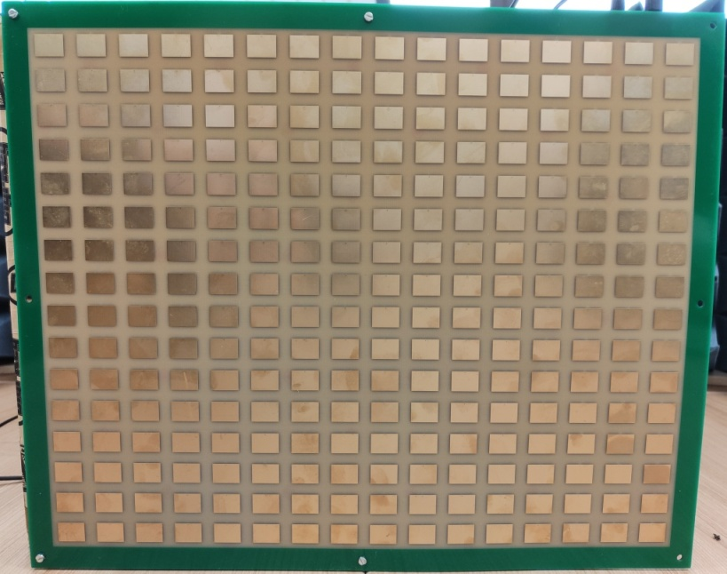
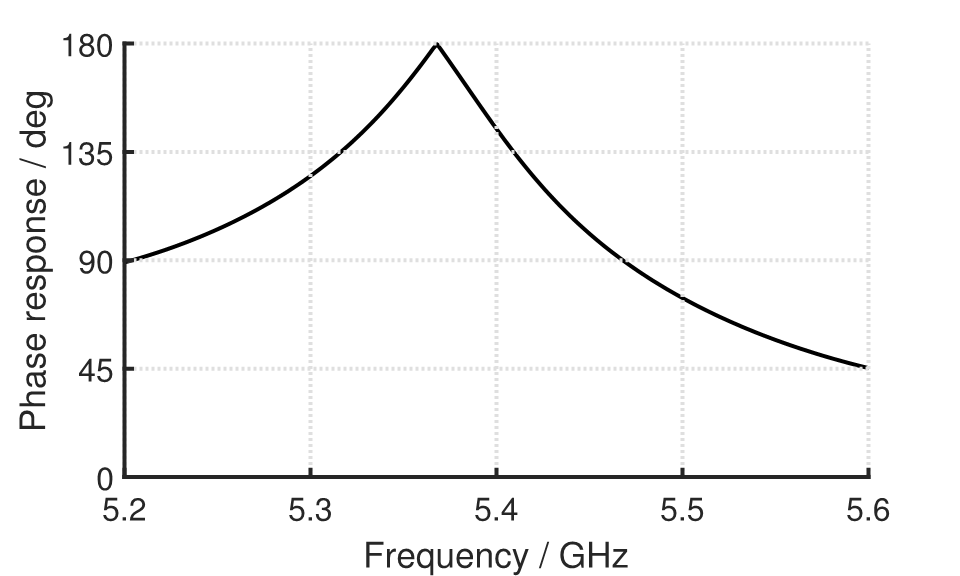
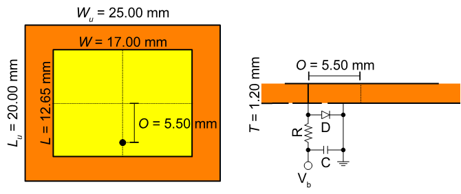
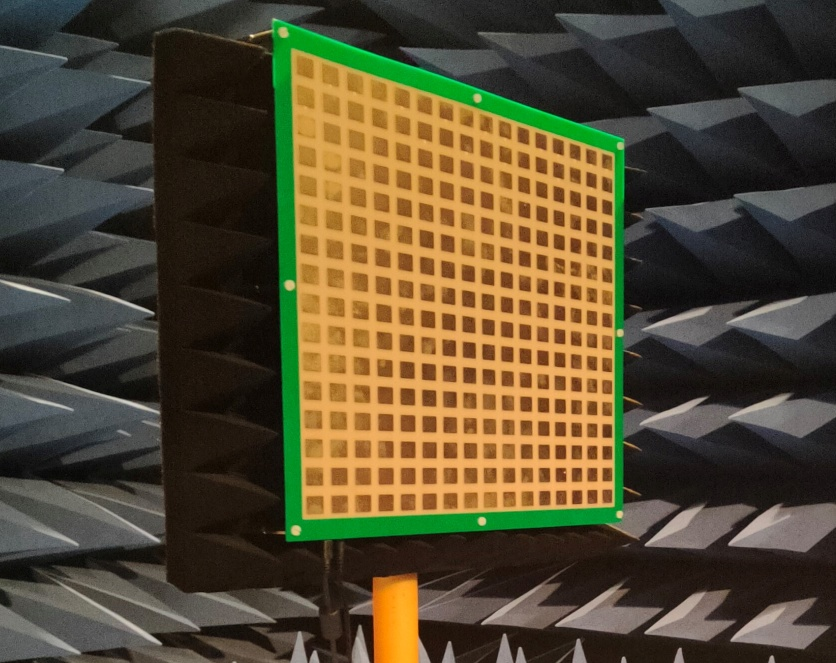
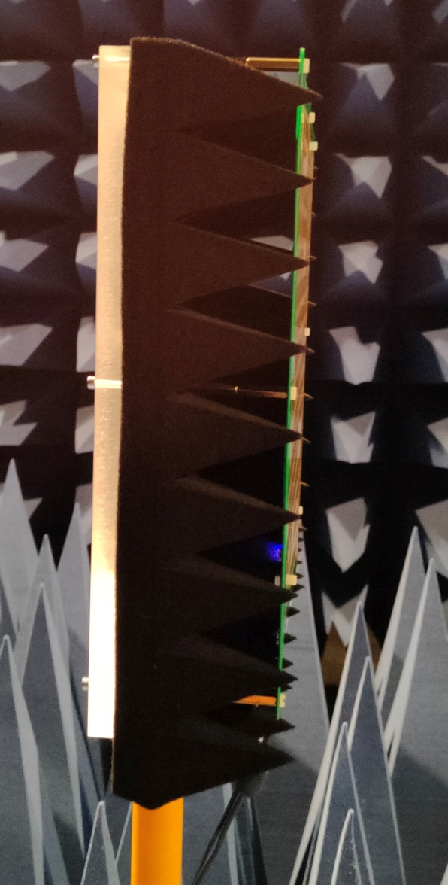

# Hardware

This page summarizes the key specifications of the hardware used during the measurement. Further details can be found in the referenced datasheets or resources.

*** 

## RIS Prototype

The prototype used for the measurement campaign is a 16x16 array of unit cells with identical structure embedded on a PCB. The resonance frequency of each individual unit cell is binary-switchable, resulting in different reflection coefficients with different phase for the two switching states. The prototype was developed within the framework of the BMBF-funded [MetaSEC](https://www.forschung-it-sicherheit-kommunikationssysteme.de/projekte/metasec) project by the consortium partner TH Cologne.

 
Fig: Frontview of the RIS prototype
  

+ Key specifications:
  + Center frequency: 5.375GHz
  + Number of elements: 16 x 16 (256 total)
  + Dimensions: 400 mm x 320mm (width x height)
  + Current consumption (All Elements on): ....mA @12VDC
  + Power supply: 12VDC
  + Control-Interface: USB
      

 
Fig: Phase response of the RIS prototype
  

 
Fig: RIS unit cell design
   

More Information on the RIS prototype design can be found in our papers [[1]](./References.md#1),[[2]](./References.md#2)
  

### RIS tripod mounting fixture

  

Fig: Front and sideview of the RIS prototype mounting fixture
  

The RIS prototype has eight M4 mounting holes on the edge of the surface to screw it to a mounting bracket. To mount the Surface on a standard tripod with 3/8" thread, a Plexiglas&reg; (PMMA) plate with 15mm thickness is used.
The PMMA plate has a 3/8" thread on the face and can be screwed vertically onto a tripod. The RIS prototype is screwed with M4 distance bushings in a distance of 100mm to the Plexiglas&reg; plate.

To prevent unwanted RF reflection from the PMMA plate, especially during reference measurements without the RIS prototype mounted, a 100mm thick pyramid foam absorber mat is used. The mat is permanently attached to the Plaxiglas plate and remains in place for all measurements.

***

## Instrumentation

#### Vector Network Analyzer (VNA)

Pico&reg; Technology PicoVNA&reg; 106

+ Key specifications:
  
  - Ports: 2
  - Frequency range: 300kHz to 6 GHz
  - ~90dB dynamic range @ 1kHz bandwidth
  - Up to 124dB dynamic range @ 10Hz bandwidth
  - USB interface
  - MatLab&reg; API

+ Datasheet: [VNA datasheet](https://www.picotech.com/download/manuals/picovna-vector-network-analyzer-data-sheet.pdf)

Corresponding SOLT-Calibration Kit (SMA female): [SOLT-Cal-Kit](https://www.picotech.com/accessories/cal-and-check-standards/standard-8.5-ghz-solt-calibration-kit-sma-female)

#### Horn Antennas

A-Info Inc. LB-187-15 Standard Gain Horn Antenna

+ Key specifications:
  
  - Frequency range: 3.95-5.85GHz
  - Antenna gain @ 6GHz: 17.61dBi
  - Antenna gain @ 5GHz: 16.35dBi
  - Polarization: Linear
  - 3dB Beamwidth (E plane): 26° (typ.)

+ Datasheet: [Horn antenna datasheet](http://www.ainfoinc.com.cn/en/pro_pdf/new_products/antenna/Standard%20Gain%20Horn%20Antenna/tr_LB-187-15.pdf)

#### RF Test Cables

Mini-Circuits&reg; CBL-15FT-SMNM+

+ Key specifications:  
  
  - Max. operating frequency: 18GHz
  - Insertion Loss @ 6GHz: 4.27dB (typ.)
  - Connector 1: N Plug (male)
  - Connector 2: SMA Plug (male)
  - Length: 15ft (4.572m)

+ Datasheet: [RF cable datasheet](https://www.minicircuits.com/pdfs/CBL-15FT-SMNM+.pdf)

#### Low Noise Amplifier (LNA)

Mini-Circuits&reg; ZX60-153LN-S+

+ Key specifications:
  
  - Frequency range: 0.5 to 15 GHz
  - Gain @ 5 GHz: 16.92 dB (typ.) 
  - Gain @ 6 GHz: 16.68 dB (typ.)
  - Operating Voltage: 12 VDC

+ Datasheet: [LNA datasheet](https://www.minicircuits.com/pdfs/ZX60-153LN-S+.pdf)

#### LNA Power Supply

Hameg (R&S&reg;) HMP2020

+ Key specifications:
  
  - Channels: 2
  - Output Voltage: 0 to 32 VDC
  - Maximum output current: 10 A (Ch 1) 5 A (Ch 2)

+ Datasheet: [Power supply datasheet](https://scdn.rohde-schwarz.com/ur/pws/dl_downloads/dl_common_library/dl_brochures_and_datasheets/pdf_1/HMP_dat_en_5215-4981-32_v0201.pdf)

***

## Miscellaneous

#### Laser distance meter

Leica Geosystems Disto&trade; D210 (aka E7300)

+ Key specifications:  
  
  - Typical Measuring Tolerance: &pm;1.0mm
  - Maximum Measuring Tolerance: +-2.0mm

+ Datasheet: [Laser distance meter datasheet](https://shop.leica-geosystems.com/sites/default/files/2019-03/leica_disto_e7300_user_manual_788218_en.pdf)

#### Tripods

Schwarzbeck AM9144 Modular Antenna Mast

+ Key specifications: 
  - Material: GFK / fibre glass
+ Technical data: [RIS tripod](https://schwarzbeck.de/Datenblatt/AM9144.pdf)

Manfrotto MKBFRTC4-BH

+ Key specifications: 
  - Material: CFK / carbon fibre
+ Technical data: [Antenna tripods](https://www.manfrotto.com/de-de/befree-advanced-carbon-reisestativ-twist-mit-kugelkopf-mkbfrtc4-bh/)

****

Missing anything? Go ahead and contact us! [Contact](../README.md#contact)
