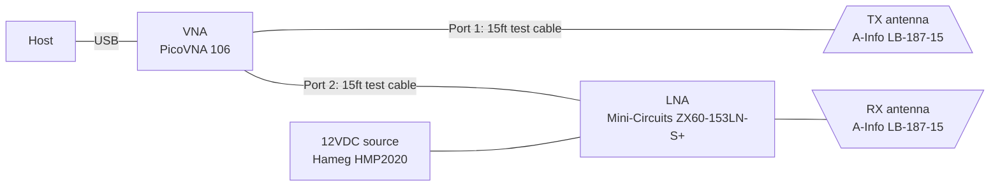

# Setup and Configuration

## Location

Measurements were performed in an anechoic chamber to prevent multipath propagation.
The chamber used is a fully-anechoic chamber of dimension 7 x 13.5 x 6 meter from manufacturer Frankonia. The chamber is located at the [Faculty of Electrical Engineering and Information Technology of the Ruhr University Bochum, Germany](https://etit.ruhr-uni-bochum.de/est/forschung/ausstattung/). It is equipped with a rotating stage, that  has a diameter of \SI{2}{\meter} for carrying the device under test. The rotating stage is recessed into the floor and is controlled via MatLab.

## Geometries

The geometrical arrangement of the antennas and the RIS in relation to each other was investigated for 30 different scenarios.
These are divided into 'specular', 'non-specular' and 'rotating stage'. 
For the specular reflection case, 9 geometries were evaluated, with the antennas statically positioned at -45° and 45°, respectively, and the distances to the RIS varied from 1 to 3m.
For the non-specular case, 19 geometries were evaluated, with the antennas statically at 0° and 45°, respectively, and the distances to the RIS varied from 1 to 7m.
For the rotating stage case, 4 geometries were evaluated, in the first three the antennas were placed statically outside the rotating stage, with the RIS rotated from -90° to 90°. In the fourth case, the transmit antenna was positioned on the rotating stage, with the receive antenna outside the rotating stage.

Each geometry is assigned a unique ID for easy identification. The IDs are broken down in a corresponding table: [[Table]](./Geometries.md)

## Instrumentation Setup

Figure: Instrumentation setup overview

An LNA is used to overcome path loss and cable loss to optimally utilize the dynamic range of the VNA.

### VNA Settings

+ S21 Measurement (Amplitude+Phase)
+ Start Frequency: 5.0 GHz
+ Stop Frequency: 6.0 GHz
+ Frequency points: 201
+ RBW: 1kHz
+ Port 1 power: 0 dBm

The VNA was calibrated using the corresponding PicoTech SOLT-calibration kit. The calibration plane is at the SMA male plugs interfacing the TX antenna at VNA port 1 and the LNA on port 2. Hence, the LNA gain and antenna gains are not included in the calibration, thus they are included in the provided S21 measurements.
